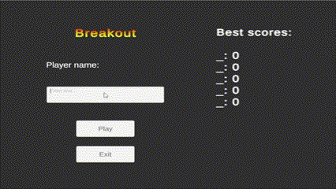

# Data persistence project

In this repository you can find the solution to the Unity's junior programmer mission "Data persistence":

https://learn.unity.com/tutorial/entrega-continuacion-de-datos-en-un-nuevo-repositorio?labelRequired=true&pathwayId=62b2353fedbc2a0e190d25c3&missionId=61a586b8edbc2a107c10d9c8#62c876ededbc2a06d9dbdb8b

The main objectives were:
 - Saving data between scenes:
   - Create a "start menu" scene with a text entry field prompting the user to enter their name. The user's name will be shown during the playthrough along its score.
 - Saving data between sessions:
   - The highest score and the name of the user who achived it will be shown during the playthrough.
   - Once the playthrough is finished, the user's name and its score will be saved and stored in a leaderboard.
   - The updated leaderboard will be stored and must be shown every time the game is run.

# Solution

The core of the solution can be found in the 'Persistent_manager.cs' file (Assets -> Scripts -> Persistent_manager.cs). This script contains a 'Persistent_manager' class that inherits from 'MonoBehaviour.' To ensure persistence, I implemented the Awake method following the Singleton pattern.

This class includes a serializable class called 'ScoreData,' which holds five 'username-score' pairs. The data is saved in a JSON file, allowing access to the highest scores across different playthroughs.

A web-browser version of the game can be found here:

https://play.unity.com/en/games/ca8a18bb-2b62-4e33-827d-b1d284d68f89/breakout-project
